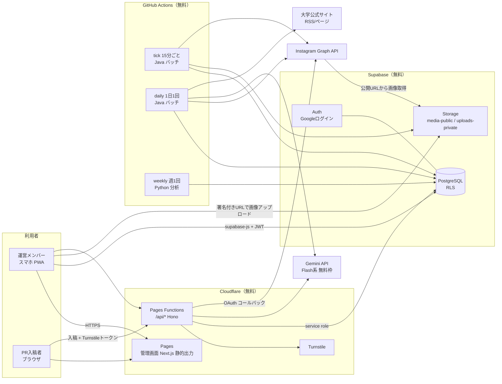
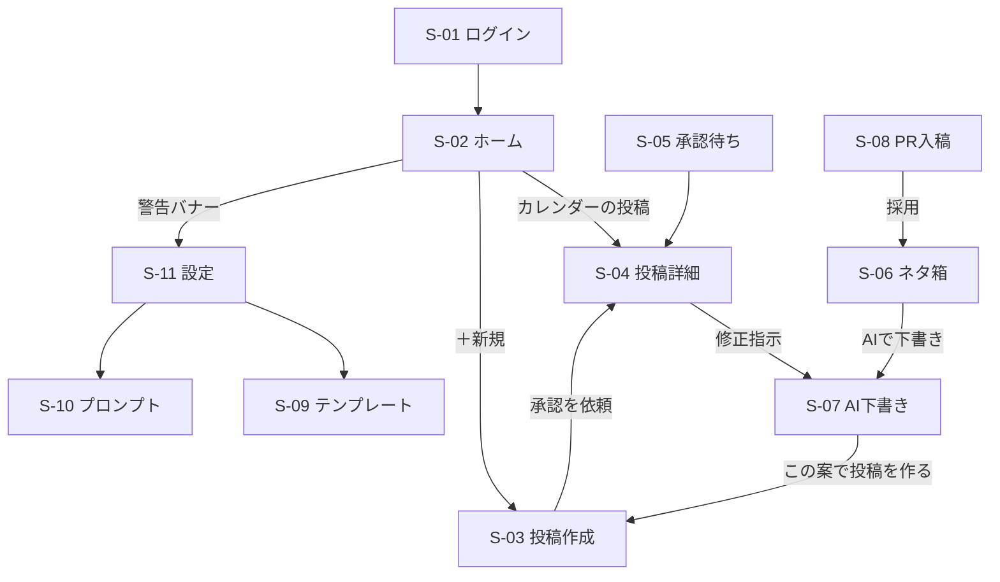
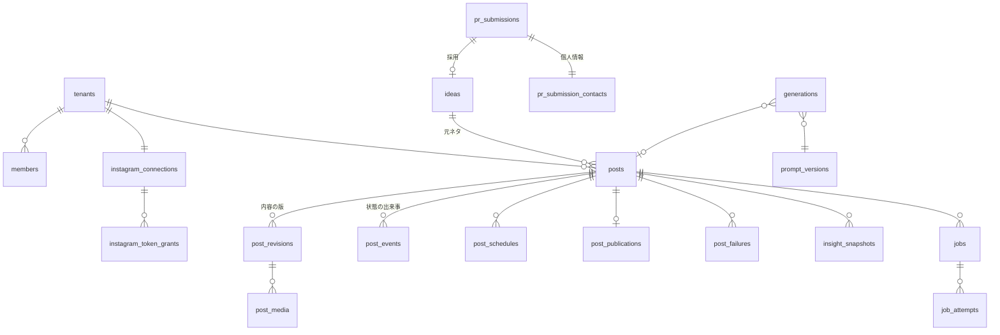

# 新島info Instagram自動投稿システム 基本設計書

- 版: 0.1（AIの下書き。梶原レビュー待ち）
- 作成日: 2026-10-01
- 元資料: 「新島info Instagram自動投稿システム 要件定義書」（2026-10-01, Claude Docs）
- 対応する要件: `docs/requirements/REQ-001`〜`REQ-004`（すべて draft。承認はユーザーが行う）
- 用語: `docs/model/domain.yaml` の言葉を使う（例: 管理画面にログインする人は「メンバー」、Instagram に出すものは「投稿」）
- 詳細設計: `01_DB設計.md`、`02_外部連携設計.md`、`REQ-001.md`〜`REQ-004.md`
- 判断記録: `docs/adr/ADR-0001`〜`ADR-0007`

> 「要確認」は、推測で決めずにフェーズ0で確かめる項目。13章の確認事項と対応づけてある。

---

## 1. 設計方針

| # | 方針 | 理由（要件の出典） |
|---|---|---|
| 1 | **常駐サーバーを持たない**。画面は Cloudflare、データは Supabase、定期処理は GitHub Actions | 月額0円（要件2章） |
| 2 | **人が触るのは「ネタの投入」と「承認」だけ**。それ以外の画面は確認用 | 要件4章 |
| 3 | **投稿状態は投稿履歴（追記のみ）から導出する** | 原則 P18。二重公開・取りこぼしを後から追えるようにする |
| 4 | **外部サービスは薄いクライアントに閉じ込め、設定で差し替えられるようにする** | 最大のリスクは外部の規約・仕様・無料枠の変更（要件11章） |
| 5 | **業務ルールはドメインオブジェクトに置く**。TS（画面側）と Java（定期処理側）の両方に同じルールがある場合は、DB の制約とトリガーで最後の砦を作る | ADR-0005 |
| 6 | **全テーブルに `tenant_id`**。当面は新島infoの1件 | 要件8章（将来のマルチテナント化） |
| 7 | 時刻はすべて `timestamptz` で保持し、画面は日本時間（Asia/Tokyo）で表示・入力する | 予約日時の誤解を防ぐ |

## 2. システム構成



### 2.1 構成要素と責務

| 構成要素 | 技術 | 責務 | 責務にしないこと |
|---|---|---|---|
| 管理画面 | Next.js（App Router, `output: 'export'`）、Tailwind、PWA | 画面表示、入力の検証（ドメイン TS）、Supabase への読み書き（RLS の範囲内） | 秘密情報の保持、Gemini/Instagram の直接呼び出し |
| API 関数 | Cloudflare Pages Functions（Hono） | 秘密情報が要る処理だけ: Gemini 呼び出し、Instagram OAuth、PR入稿の受付、メンバーの招待 | 画面の描画、定期処理 |
| DB・認証・画像 | Supabase（PostgreSQL, Auth, Storage） | 事実の記録、RLS による団体・ロールの境界、状態遷移の最終チェック（トリガー） | 業務判断の本体（ドメインに置く） |
| 定期処理 | GitHub Actions cron ＋ Java 17 / Spring Boot（非Web）、Playwright for Java | スライドの画像化（HTML→JPEG。REQ-002）、予約投稿の公開、トークン更新、インサイト収集、ネタ収集、下書き一括生成 | 画面からの即時処理 |
| 分析 | GitHub Actions ＋ Python（pandas） | 週次の集計を `insight_reports` に書き込む | 日次の数値取得（Java が行う） |

**判断**: 要件7章の「管理画面 Next.js を Cloudflare Pages / Workers で配信」を、**静的出力＋小さな API 関数**の形に具体化した。Next.js をサーバーとして Workers で動かす形（OpenNext）は、無料プランの CPU 時間（1リクエスト10ms）とバンドルサイズ（3MB）の上限に当たりやすいため（ADR-0002）。

## 3. 開発リポジトリ構成

リポジトリ: 本リポジトリ（`auto-Instagram`）。ハーネス（`harness.yaml`）のレイヤ判定に合わせる。

```
backend/                       Java 17（開発PCに合わせる。2026-10-01 決定）, Spring Boot 3（非Web）, Maven
  src/main/java/jp/co/keai/niijimaig/
    post/          domain/ application/ infrastructure/ presentation/
    connection/    domain/ application/ infrastructure/
    generation/    domain/ application/ infrastructure/
    idea/          domain/ application/ infrastructure/
    insight/       domain/ application/ infrastructure/
    job/           domain/ application/ infrastructure/ presentation/  ← CLI 入口（tick / daily）
    shared/        domain/（団体ID・日時など共通の値）
  src/main/resources/db/migration/   Flyway（V1__...sql） ← DB の正
frontend/                      Next.js（静的出力）
  src/domain/<関心事>/          TS ドメイン（投稿・キャプション・画像仕様…）
  src/lib/api/                  Supabase・API 関数のクライアント（application 扱い）
  src/app/                      画面（presentation）
  functions/api/                Cloudflare Pages Functions（Hono）
    domain/ application/ infrastructure/ presentation/
analysis/                      Python（pandas）週次分析
templates/                     投稿テンプレート HTML/CSS とフォント（画面と定期処理で共有）
.github/workflows/             ci.yml, tick.yml, daily.yml, weekly.yml
docs/                          要件・用語集・設計・ADR
```

- パッケージは**業務の関心事**で分ける（P28）。`dto/` `util/` は作らない。
- `harness.yaml` の `internal_prefixes` は `com.example` のままなので、`jp.co.keai.niijimaig` への変更を**提案**する（ハーネスは保護対象のため人が変更する）。
- DB スキーマの正は Flyway のマイグレーション。Supabase の SQL エディタで直接変更しない。

## 4. 機能一覧と配置

| ID | 機能 | フェーズ | 画面 | API関数 | 定期処理 | 要件 |
|---|---|---|---|---|---|---|
| F-01 | ログイン・ロール管理 | 1 | S-01, S-11 | —（RPC `invite_member`） | — | REQ-001 |
| F-02 | Instagram連携 | 1 | S-11 | `GET /api/instagram/connect`, `GET /api/instagram/callback` | — | REQ-001 |
| F-03 | 投稿作成 | 1 | S-03 | — | — | REQ-001 |
| F-04 | 予約投稿 | 1 | S-04 | — | tick: 公開 | REQ-001 |
| F-05 | 投稿カレンダー | 1 | S-02 | — | — | REQ-001 |
| F-06 | 警告バナー | 1 | 全画面 | — | daily: トークン確認 | REQ-001 |
| F-07 | テンプレートの画像化 | 2 | S-03, S-09 | — | tick: スライドの画像化 | REQ-002 |
| F-21 | AI での画像生成（背景・イラスト・写真風） | 1.5（本番稼働の直後） | S-03, S-13 | `POST /api/image-generations` ほか（Workers AI・Gemini） | daily: 放置された候補を消す | REQ-005 |
| F-08 | AIキャプション生成 | 2 | S-07 | `POST /api/generations` | — | REQ-002 |
| F-09 | 自然文での修正指示 | 2 | S-04, S-07 | `POST /api/generations`（REVISE） | — | REQ-002 |
| F-10 | 手動コピペモード | 2 | S-07 | `POST /api/generations/manual` | — | REQ-002 |
| F-11 | プロンプト管理・生成ログ | 2 | S-10 | — | — | REQ-002 |
| F-12 | ネタ箱 | 3 | S-06 | — | — | REQ-003 |
| F-13 | AI企画生成 | 3 | S-06→S-07 | `POST /api/generations`（PLAN） | daily: 下書き一括生成 | REQ-003 |
| F-14 | 自動チェック | 3 | S-04, S-05 | — | — | REQ-003 |
| F-15 | 承認フロー | 3 | S-05, S-04 | — | — | REQ-003 |
| F-16 | PR入稿フォーム | 3 | P-01, S-08 | `POST /api/pr-submissions` ほか | — | REQ-003 |
| F-17 | ネタ収集 | 4 | S-06 | — | daily: ネタ収集 | REQ-004 |
| F-18 | 効果分析 | 4 | S-12 | — | daily: インサイト収集 / weekly: 分析 | REQ-004 |

**フェーズ1の承認**: 状態遷移はフェーズ1から最終形（承認待ちを含む）で作り、フェーズ1では「承認依頼 → 承認者が日時を決めて承認」の簡易な画面だけを出す。フェーズ3で承認待ち一覧・自動チェック・修正指示を足す。状態遷移を後から変えないため（REQ-001 open_questions で合意を取る）。

## 5. 画面設計（基本）

スマホファースト（幅 375px 基準）。下部タブ「ホーム / ネタ / 承認 / 設定」（フェーズ1は「ホーム / 新規投稿 / 設定」）。

見た目は Apple の Human Interface Guidelines に沿う（2026-10-02 梶原の指示）: iOS のシステムカラーとグループ化した背景・ラベルの色をトークンにし（`frontend/src/app/globals.css`。ダークモード対応）、インセットグループのリスト・大きなタイトル・セグメンテッドコントロール・半透明のタブバーを使う。タップ領域は 44pt 以上。主な操作は塗りのボタン、破壊的な操作は赤文字。共通部品は `frontend/src/components/ui/`。

| ID | 画面（タスク） | 主な利用者 | 関心事 | フェーズ |
|---|---|---|---|---|
| S-01 | ログイン | 全員 | Googleでログインする | 1 |
| S-02 | ホーム（投稿カレンダー＋警告バナー） | 全員 | 今後の予定と、問題が起きていないか | 1 |
| S-03 | 投稿を作る・編集する | 編集者 | 画像・キャプション・PR区分・ジャンルをそろえる | 1（テンプレートは2） |
| S-04 | 投稿を確認する（詳細） | 全員 | プレビュー、状態、履歴、承認・修正指示・予約取消・再実行 | 1 |
| S-05 | 承認待ち一覧 | 承認者 | 承認すべきものと、自動チェックの指摘 | 3 |
| S-06 | ネタ箱 | 編集者 | 一言メモの投入、ニュース・PRのネタの確認、AI企画の起動 | 3 |
| S-07 | AIで下書きを作る | 編集者 | 下書き案の生成・修正指示・手動コピペ | 2 |
| S-08 | PR入稿一覧・採否 | 承認者 | 入稿内容の確認と採否 | 3 |
| S-09 | テンプレート管理 | 管理者 | トンマナの HTML/CSS とプレビュー | 2 |
| S-10 | プロンプト管理・生成ログ | 管理者 | プロンプト版の作成・有効化、生成の履歴 | 2 |
| S-11 | 設定 | 管理者 | Instagram連携、メンバー、LLM設定、NG表現、ジャンル | 1 |
| S-12 | 分析 | 全員 | ジャンル・形式・時刻帯ごとの傾向、導入効果 | 4 |
| P-01 | PR入稿フォーム（公開） | PR入稿者 | 文面・画像・希望日・連絡先を送る | 3 |

### 5.1 画面遷移



### 5.2 「3タップで予約」の導線（NFR-001-02, NFR-003-01）

1. ホームまたは承認タブの「承認待ち n件」カード → 2. 投稿をタップ（詳細：プレビュー・自動チェックの指摘・提案された予約日時が入った状態）→ 3.「この日時で承認」。

## 6. 定期処理（バッチ）設計（基本）

| ワークフロー | 起動 | 実行内容（順番） | 想定時間 |
|---|---|---|---|
| `tick.yml` | cron `*/15 * * * *`（UTC）、手動実行可 | ①稼働記録（開始）②実行期限切れジョブの回収（中断した公開は、回収した公開ジョブの中で確かめる）③公開用画像の準備ジョブ ④公開ジョブ ⑤稼働記録（終了） | 1〜2分（スライドの画像化がある回は+1分） |
| `daily.yml` | cron `0 19 * * *`（UTC = 日本時間4:00） | ①トークン確認・更新 ②インサイト収集 ③ネタ収集 ④下書き一括生成（フェーズ3以降、設定でON） | 3〜5分 |
| `weekly.yml` | cron `0 20 * * 0`（日本時間 月曜5:00） | Python で集計し `insight_reports` に書く | 1分 |
| `ci.yml` | push / PR | ハーネス `check --strict`、Java テスト（Testcontainers）、frontend lint/test/build | — |

- **二重起動の防止**は2段: ワークフローの `concurrency: { group: tick, cancel-in-progress: false }` と、DB のジョブ実行権（`FOR UPDATE SKIP LOCKED` ＋ 実行期限）。詳細は `REQ-001.md`。
- **ジョブは「予定表」に積んでから実行する**。画面の操作（承認・再実行）はジョブを積むだけで、外部 API を呼ぶのは定期処理だけ（Instagram API の呼び出し元を1か所にする）。
- GitHub の cron は混雑時に数分〜数十分遅れることがある。「予約日時ぴったりの公開は保証しない」（要件2章）を画面にも明記する。

### 6.1 GitHub Actions の無料枠（要確認：リポジトリの公開／非公開）

| 条件 | tick の月間実行 | 消費（1回 約1〜2分で切り上げ） | 判定 |
|---|---|---|---|
| 公開リポジトリ | 2,880回 | 標準ランナーは無料・無制限 | OK |
| 非公開リポジトリ（無料 2,000分/月） | 2,880回 | 約2,900〜5,800分 | **超過** |

非公開にする場合は、①tick を日本時間 7:00〜24:00 だけにする（約2,040回）②間隔を30分にする ③1回の時間を1分以内に抑える、を組み合わせても上限ぎりぎりになる。**公開リポジトリを推奨**し、秘密情報は GitHub Secrets とSupabase にだけ置く（ADR-0001）。公開リポジトリでも、ログに秘密情報・個人情報を出さないことを徹底する（6.2）。

### 6.2 定期処理のログ方針

- 公開リポジトリでは Actions のログが誰でも見られる。ログには ID・状態・件数・エラーの種類だけを出し、**キャプション本文・入稿者連絡先・トークン・APIレスポンス本文は出さない**。
- 失敗の詳細は DB（`job_attempts.error_detail`、RLS で管理者のみ）に残す。

### 6.3 定期処理の停止を防ぐ・気づく

| 事象 | 対策 |
|---|---|
| GitHub が60日間リポジトリ更新のない公開リポジトリの cron を止める | 月1回、`daily.yml` の最後に GitHub API でワークフローを有効化し直す（`PUT /repos/{owner}/{repo}/actions/workflows/{id}/enable`）。止まった場合は BATCH_STOPPED の警告で気づく（要確認：最新の停止条件） |
| Supabase 無料プロジェクトが一定期間アクセスなしで一時停止 | tick が15分ごとに DB に書くため発生しない |
| ワークフロー自体の失敗 | GitHub がリポジトリオーナー（京愛）にメール。トークン期限切れが近い場合は意図的に失敗させる（REQ-001 BR-001-11） |
| 黙って動いていない | 最後のバッチ稼働記録から60分以上で BATCH_STOPPED 警告 |

## 7. データ設計（基本）

詳細は `01_DB設計.md`。要件8章のテーブルを、原則 P17〜P19・P31（記録のタイミングが違うものは分ける、追記のみ、状態は導出）に沿って次のように具体化した。

| 要件8章のテーブル | 本設計 | 変更理由 |
|---|---|---|
| tenants | `tenants`, `tenant_settings` | 設定は変更の履歴を残したい（版で追記） |
| members | `members`, `member_role_changes`, `member_deactivations` | ロール変更・無効化を上書きせず記録 |
| ig_accounts | `instagram_connections`, `instagram_token_grants`, `instagram_token_refresh_failures`, `instagram_disconnections` | トークンの取得・更新を追記にし、有効なトークンは最新の記録から導出 |
| posts | `posts`（作成時に決まる事実）, `post_revisions`（内容の版）, `post_events`（状態の出来事）, `post_schedules`（予約日時の確定）, `post_publications`（公開結果）, `post_failures`（失敗理由） | 状態・内容・予約・結果は記録のタイミングが違う。状態は `post_events` から導出（ビュー `post_current`） |
| post_media | `post_media`（版ごとの投稿画像）, `rendered_media`（テンプレートから生成した画像） | 版に紐づける |
| templates | `templates`, `template_versions` | 公開済み投稿がどの版で作られたか残す |
| ideas | `ideas`, `idea_dispositions`（使った／見送った） | |
| pr_submissions | `pr_submissions`, `pr_submission_contacts`（個人情報を分離）, `pr_submission_media`, `pr_submission_decisions` | 個人情報だけを別テーブルにし、RLS と削除期限を別に管理 |
| prompt_versions | `prompt_versions`, `prompt_activations` | 本文は不変、有効化を追記 |
| generations | `generations`, `generation_feedbacks`（承認結果・修正指示） | 生成と、その後の評価はタイミングが違う |
| jobs | `jobs`, `job_attempts` | ジョブは予定表として UPDATE を許す（ADR-0006）。試行は追記 |
| insights | `insight_snapshots` | 1投稿1日1件、追記 |
| llm_usage | `llm_usage_daily` | 原子的な加算のため UPDATE を許す（ADR-0006） |
| （追加） | `batch_heartbeats`, `news_sources`, `news_items`, `ng_expressions`, `genres`, `insight_reports`, `oauth_states` | 停止検知、ネタ収集の重複防止、自動チェック、分析 |

### 7.1 主要な ER（抜粋）



## 8. 外部連携（基本）

詳細は `02_外部連携設計.md`。

| 連携先 | 方式 | 呼び出し元 | 認証 | 主な制約 |
|---|---|---|---|---|
| Instagram Graph API（Instagramログイン方式） | REST | 定期処理（公開・インサイト・トークン更新）、API関数（OAuth のみ） | 長期アクセストークン（60日、更新可） | 画像はJPEGを公開URLで渡す、24時間の API 公開数上限、トークン期限 |
| Gemini API | REST（JSON スキーマ出力） | API関数（画面からの生成）、定期処理（一括生成） | APIキー | 無料枠の回数上限（要確認）、無料枠では入出力が改善に使われうる（新島infoと合意済み） |
| 大学公式サイト | RSS / HTML 取得 | 定期処理 | なし | 1日1回、robots.txt に従う、転載しない |
| Cloudflare Turnstile | siteverify | API関数 | シークレットキー | — |

**要件からの変更提案**: 要件7章は「承認済みの画像を **PNG** 化」としているが、Instagram Graph API の画像投稿は **JPEG のみ**対応のため、公開用は JPEG（品質90）で出力する。画面のプレビューは HTML のまま（変更なし）。

## 9. セキュリティ設計（基本）

| 対象 | 方式 |
|---|---|
| ログイン | Supabase Auth（Google）。メンバー表（許可リスト）にない／無効化されたアカウントは、RLS ですべて拒否し、画面は「利用が許可されていません」を出す |
| 認可 | RLS で「団体」と「ロール」を判定（関数 `app.current_member()`）。画面の出し分けは補助で、正は RLS |
| 秘密情報 | Gemini APIキー・Instagram アプリシークレット・トークン暗号鍵・Supabase service role キーは Cloudflare の環境変数（Secret）と GitHub Secrets のみ。ブラウザに出すのは Supabase の anon キーと URL だけ |
| アクセストークン | AES-256-GCM で暗号化して `instagram_token_grants.token_ciphertext` に保存（ADR-0007）。復号するのは API 関数（取得直後の検証のみ）と定期処理だけ。テーブルは RLS でクライアントから読めない |
| PR入稿 | Turnstile、IP ごとの受付上限、添付は署名付きURLで非公開バケットへ。入稿者連絡先は別テーブルで承認者以上のみ参照、LLM に渡さない、保存期限で削除（要確認） |
| 画像 | 公開用バケット `media-public` はパスに推測できない UUID を使う（Instagram が取得するため公開が必要）。下書き段階の画像は非公開バケット `uploads-private` |
| テンプレート | 管理者だけが編集。プレビューは `sandbox` 属性の iframe（スクリプト不可）、差し込み文言は HTML エスケープ |
| ログ | 6.2 のとおり |
| 依存ライブラリ | Dependabot を有効化 |

## 10. 非機能要件の実現方法

| 区分 | 要件（6章） | 実現方法 | 検証（NFR ID） |
|---|---|---|---|
| 操作性 | スマホファーストの PWA、3タップで予約 | 下部タブ、承認待ちカードからの直行、予約日時の提案を初期値に | NFR-001-02, NFR-003-01（Playwright のモバイル表示テスト） |
| コスト | 月額0円 | 無料枠のみ、課金を有効にしない、上限の手前で止める（LLM 利用回数、Actions の公開リポジトリ） | NFR-001-01（レビュー） |
| 性能 | 15分間隔、LLM 上限手前で停止 | tick、`llm_usage_daily` の原子的な確保 | NFR-002-03 |
| 可用性 | 遅延・失敗は免責、失敗は理由を記録し再実行 | `post_failures`、再実行操作、BATCH_STOPPED 警告 | NFR-001-06 |
| セキュリティ | パスワードを預からない、トークン暗号化、許可リスト | 9章 | NFR-001-03, NFR-001-05 |
| プライバシー | 不要な個人情報を LLM に送らない | 入稿者連絡先の分離、生成入力の組み立てで型として渡せないようにする | AC-002-09 |
| 保守性 | LLM の提供元・モデル名は設定値、主要テーブルに団体ID | `tenant_settings`、`LlmClient` インターフェース | AC-002-10 |
| データの帰属 | 提供終了時は削除またはエクスポート | 団体単位のエクスポート（CSV＋画像 zip）を手動スクリプトで提供（`scripts/export_tenant`） | レビュー |

## 11. 環境とデプロイ

| 環境 | 画面・API関数 | DB | 定期処理 | 用途 |
|---|---|---|---|---|
| ローカル | `next dev` ＋ `wrangler pages dev` | Supabase CLI（Docker） | `./mvnw spring-boot:run -Dspring-boot.run.arguments=--job=tick` | 開発 |
| 本番 | Cloudflare Pages（main ブランチ） | Supabase 本番プロジェクト | GitHub Actions | 運用 |

- 無料枠の制約上、ステージング用の Supabase プロジェクトは作らない（無料は2プロジェクトまで。1つは予備として残す）。本番への反映は人が確認してから行う（開発部ルール）。
- DB 変更は Flyway。CI で Testcontainers の PostgreSQL に流してテストし、本番へは手動ワークフロー（`migrate.yml`、承認付き environment）で適用する。
- Cloudflare Pages のプレビューデプロイは本番 DB を向くため、**プレビューは無効化**する（または anon キーを渡さない）。

## 12. 運用設計（基本）

| 項目 | 内容 |
|---|---|
| アカウント名義 | GitHub・Supabase・Cloudflare・Gemini APIキー・Meta 開発者アプリは京愛名義。Instagram アカウントは新島info（要件10章） |
| 障害の検知 | 警告バナー、Actions 失敗メール（京愛）、意図的なワークフロー失敗（トークン） |
| 障害時の手順 | `docs/runbook.md`（実装時に作成）：連携のやり直し、手動での tick 実行、失敗投稿の再実行、手動コピペモード |
| メンバーの追加・削除 | 新島info側の承認者が S-11 から行う（代替わりのたびに発生）。管理者ロールの付与だけ京愛 |
| バックアップ | Supabase 無料枠には利用者が取り出せる自動バックアップがない前提で、月1回、京愛が手元で `scripts/export_tenant`（DB の団体データ＋画像）を実行し、京愛の保管場所に置く（要確認：保管場所）。公開リポジトリの Actions アーティファクトは誰でも取得できるため使わない |
| 引き継ぎ | テンプレート・プロンプト・運用ルールはシステム内に残す（要件10章） |

## 13. フェーズ0（2026年10月）で確かめること

設計の前提になっている「要確認」をまとめる。結果で ADR と要件の open_questions を更新する。

| # | 確認すること | 影響する設計 |
|---|---|---|
| 1 | Meta 開発者アプリを作り、Instagramログイン方式でテスター登録 → テスト投稿（画像・カルーセル）が通るか | ADR-0003、02_外部連携設計 |
| 2 | 現行の API 仕様: 画像形式（JPEG のみ）、カルーセル上限枚数、24時間の公開数上限、Insights の指標名 | 画像仕様、投稿種別、インサイト |
| 3 | Gemini 無料枠の商用利用条件と上限値（AI Studio） | ADR-0004、LLM上限 |
| 4 | Gemini で、新島infoの過去投稿5〜10件を例にしたときの品質 | プロンプト初版、テンプレート |
| 5 | リポジトリ公開／非公開の決定 | ADR-0001、6.1 |
| 6 | Cloudflare Pages Functions の無料枠で Gemini 呼び出し（待ち時間30秒程度）が問題なく動くか | ADR-0002 |
| 7 | ベースライン計測（作業時間・投稿数・反応） | REQ-004 |
