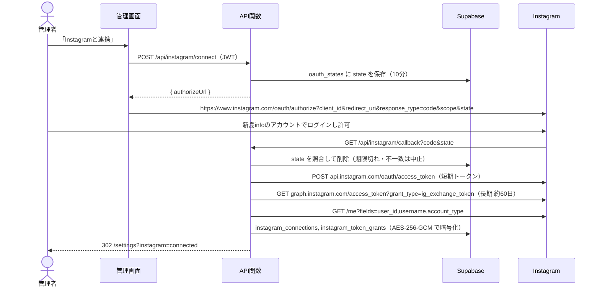
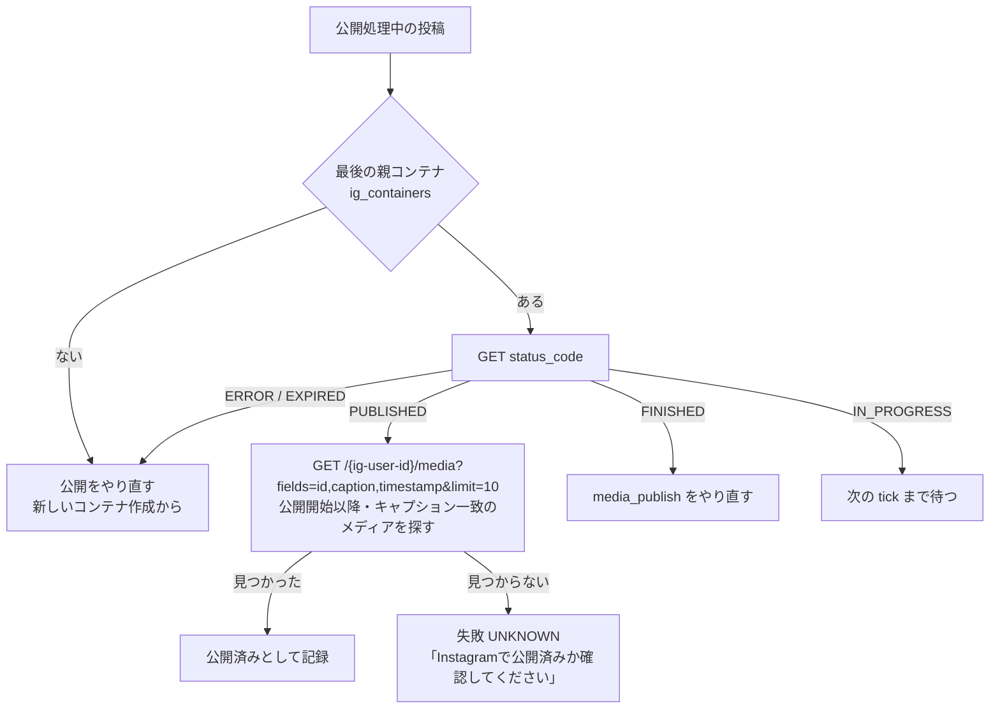

# 外部連携・API 詳細設計

- 版: 0.1（AIの下書き）／作成日: 2026-10-01
- 外部 API の仕様は変わりやすい。**着手時（フェーズ0）に各公式ドキュメントで最新を確認する**（要件9章）。下の値のうち「要確認」は、本書作成時点の知識に基づく推測を含む
- 原則: 外部 API は薄いクライアントに閉じ込め（infrastructure 層）、ドメインには用語集の言葉だけを渡す（P16, P21）

---

## 1. Instagram Graph API（Instagramログイン方式）

方式の選択は ADR-0003。Facebook ページを介さない「Instagram API with Instagram Login」を使う。ホストは `graph.instagram.com`、API バージョンは設定値 `IG_API_VERSION`（要確認：着手時の最新）。

### 1.1 OAuth 連携（API関数）



- スコープ: `instagram_business_basic`, `instagram_business_content_publish`, `instagram_business_manage_insights`（要確認）
- `account_type` が BUSINESS / MEDIA_CREATOR 以外なら保存せず `/settings?instagram=error&reason=account_type` に戻す
- アプリは開発モードのまま、新島infoのアカウントを**テスター**として登録して使う（App Review なし。要件2章）
- コールバックのエラー（`error=access_denied` など）は理由を画面に出す。トークンはどのレスポンス・ログにも出さない

### 1.2 トークン更新（定期処理 daily）

- `GET graph.instagram.com/refresh_access_token?grant_type=ig_refresh_token&access_token=...`
- 条件: 取得から24時間以上経過かつ未失効（API側の条件）。本システムは**残り30日以下**で更新する（`TokenExpiry.needsRefresh()`）
- 結果は `instagram_token_grants`（REFRESH）に追記。失敗は `instagram_token_refresh_failures`
- 残り7日以下で更新に失敗したら、終了コード 1 でワークフローを失敗させる（京愛にメールが届く）

### 1.3 公開（定期処理 tick）

| 手順 | 画像（FEED_IMAGE） | カルーセル（CAROUSEL） |
|---|---|---|
| ① コンテナ作成 | `POST /{ig-user-id}/media` `image_url`, `caption` | 画像ごとに `POST /{ig-user-id}/media` `image_url`, `is_carousel_item=true`（CHILD）→ `POST /{ig-user-id}/media` `media_type=CAROUSEL`, `children=id1,id2,..`, `caption`（CAROUSEL） |
| ② 処理状態の確認 | `GET /{container-id}?fields=status_code` を 5秒間隔・最大60秒。`FINISHED` で次へ、`ERROR`/`EXPIRED` は失敗 | 親コンテナで同じ |
| ③ 公開 | `POST /{ig-user-id}/media_publish` `creation_id` → `{ id: メディアID }` | 同じ |
| ④ 結果取得 | `GET /{media-id}?fields=permalink,timestamp` | 同じ |

- `image_url` は `media-public` の公開URL。コンテナIDは作成のたびに `ig_containers` に記録（中断からの復旧に使う）
- `caption` は `Post.publishCaption()`（PR案件ならPR表記を先頭に付けたもの）
- 公開前に `GET /{ig-user-id}/content_publishing_limit?fields=quota_usage,config` で24時間の公開数（100件。要確認）を確認し、超えていれば RATE_LIMITED で翌 tick に回す

#### 中断からの復旧（AC-001-15）

公開処理中（PUBLISHING）のまま実行期限を過ぎた公開ジョブは、tick の最初に回収されて PENDING に戻り、**同じ公開ジョブの次の試行の中で**次の順で確かめる（ジョブの実行権の中で行うので、復旧と通常の公開が同時に走らない）。



- 二重公開の最後の砦は `post_publications.post_id` の主キーと `ig_media_id` の一意制約（同じ投稿の公開記録は1件しか書けない）。ただし Instagram 側の二重公開は DB では防げないため、**media_publish を呼ぶ前に必ずコンテナの状態を確認**する

### 1.4 エラーの分類（失敗区分への対応）

| Instagram の応答 | 失敗区分 | 同じジョブ内リトライ |
|---|---|---|
| HTTP 5xx、タイムアウト、`is_transient: true` | TRANSIENT | する（10秒→30秒→90秒、最大3回） |
| `code` 4 / 17 / 32 / 613、公開数上限 | RATE_LIMITED | しない。公開延期（公開処理中→予約中）にして次の tick に回す。jobs.max_attempts を使い切ったら失敗 |
| `code` 190（トークン無効・期限切れ）、`code` 10 / 200 番台の権限エラー | TOKEN_INVALID | しない |
| コンテナ `ERROR`、`code` 9004・2207xxx（画像の取得失敗・形式不正など。要確認） | MEDIA_REJECTED | しない |
| 上記以外 | UNKNOWN | しない |

`InstagramErrorClassifier`（infrastructure）がこの表を実装し、ドメインの `FailureKind` を返す。表はテストで固定する。

### 1.5 インサイト（定期処理 daily, フェーズ4）

- `GET /{media-id}/insights?metric=reach,saved,shares,likes,comments,views`（指標名は要確認。`impressions` は廃止の方向）
- 対象: 公開後30日以内の公開済み投稿。1投稿1日1件（`insight_snapshots` の主キーで重複防止）
- 取得できない指標は NULL（views のみ許容）。それ以外が取れない場合はその投稿をスキップし、ジョブは続行

## 2. Gemini API

### 2.1 呼び出し

- `POST https://generativelanguage.googleapis.com/v1beta/models/{model}:generateContent`、ヘッダ `x-goog-api-key`
- `generationConfig`: `responseMimeType: "application/json"`, `responseSchema`（2.2）, `temperature: 0.7`（企画）/ `0.4`（修正）
- モデル名は `tenant_settings.llm_model`（例: Flash 系。要確認）。タイムアウト 60 秒
- 呼ぶ前に `app.try_consume_llm(tenant, model, limit)` で1回分を確保。拒否されたら呼ばない（QUOTA_EXCEEDED）
- 429（RESOURCE_EXHAUSTED）: 画面からの生成は即座に QUOTA_EXCEEDED を返して手動コピペを案内。一括生成（daily）は60秒空けて1回だけ再試行し、だめなら残りを翌日に回す
- 5xx: 1回だけ再試行

### 2.2 出力の JSON スキーマ（下書き案）

```json
{
  "type": "object",
  "required": ["format", "slides", "caption", "hashtags", "prCategory", "sourceUrls", "genre"],
  "properties": {
    "format":     { "type": "string", "enum": ["FEED_IMAGE", "CAROUSEL"] },
    "slides": {
      "type": "array", "minItems": 1, "maxItems": 10,
      "items": {
        "type": "object", "required": ["role", "heading", "body"],
        "properties": {
          "role":    { "type": "string", "enum": ["COVER", "BODY", "CLOSING"] },
          "heading": { "type": "string" },
          "body":    { "type": "string" }
        }
      }
    },
    "caption":    { "type": "string", "description": "ハッシュタグを含まない本文" },
    "hashtags":   { "type": "array", "maxItems": 30, "items": { "type": "string" } },
    "prCategory": { "type": "string", "enum": ["NONE", "PR"] },
    "sourceUrls": { "type": "array", "items": { "type": "string" } },
    "genre":      { "type": "string", "description": "団体のジャンル一覧から1つ" },
    "proposedScheduledAt": { "type": "string", "description": "ISO 8601 (+09:00)。提案がなければ空文字" }
  }
}
```

- スキーマ指定だけでは文字数・枚数の上限が守られないことがあるため、受け取った後に**ドメインの `DraftProposal` の完全コンストラクタで検証**する（スライド見出し40字・本文200字・キャプション2,200字・ハッシュタグ30個・形式と枚数の整合・ニュースなら参照元URL必須）。違反は INVALID_OUTPUT とし、1回だけ「どこが違反か」を添えて再生成する（BR-002-03）
- `genre` が団体のジャンルにない場合は、画面でジャンル未選択として扱う（承認依頼時に必須）
- PR入稿由来のネタでは、出力の `prCategory` に関係なく PR に固定する（`IdeaSource.initialPrCategory()`、BR-003-07）

### 2.3 入力の組み立て（個人情報を含めない）

`GenerationInput`（ドメインの値）だけがプロンプトに入る。型として持てる項目は次に限る。入稿者連絡先は型に存在しないので、入れようとしてもコンパイルが通らない（AC-002-09）。

| 項目 | 内容 |
|---|---|
| idea | ネタ本文、ネタの出どころ、参照元URL、（PRなら）団体名・希望日 |
| examples | 伸びた投稿（最大3件）のキャプション・スライド見出し・ジャンル・形式（フェーズ3〜） |
| genres | 団体のジャンル名の一覧 |
| ngExpressions | NG表現の一覧（使わないよう指示） |
| today | 日本時間の今日の日付と曜日（曜日の誤りを防ぐ） |
| previous / instruction | 修正指示のとき：直前の下書き案と修正指示 |

プロンプト本文（`prompt_versions.body`）は Mustache 形式の差し込み（`{{idea.body}}` など）。差し込みは API関数と Java の両方で同じテストデータを使ったスナップショットテストで一致を確認する。

### 2.x 画像生成の指示の英訳（REQ-005。REQ-002 より先に作る）

- API関数から `generateContent` を呼び、日本語の指示を英語の1文に直す（出力は英文だけ。15秒で打ち切り）。モデルは `tenant_settings_current.llm_model`
- 呼ぶ前に `try_consume_llm`（LLM利用回数）で1回分を確保する。上限・失敗なら画像生成しない（REQ-005 BR-005-10）
- 英訳用のプロンプトは、当面はコードの定数。REQ-002 でプロンプト版の管理に乗せるかを決める（申し送り）

## 2b. Cloudflare Workers AI（画像生成。REQ-005、ADR-0008）

- API関数（Pages Functions）に AI バインディング（`frontend/wrangler.toml` の `[ai] binding = "AI"`）を付け、`env.AI.run("@cf/black-forest-labs/flux-1-schnell", { prompt, steps: 4 })` を候補の数（4）だけ呼ぶ。応答は base64 の JPEG（1024×1024 固定。`seed`・縦横比は指定できない）
- 無料枠は 1日 10,000 Neurons（UTC 0:00 リセット）。1枚 57.6 Neurons。超えると失敗する（課金されない）→ 502 GENERATION_FAILED
- 呼び出し口は application の `CandidateImageClient`。提供元・モデルは `image_generation_settings_current`
- 候補の画像は service role で `uploads-private/{団体}/candidates/{画像生成ID}/{位置}.jpg` に保存し、期限付き URL（1時間）で画面に返す

## 3. 大学ニュースの収集（定期処理 daily, フェーズ4）

- RSS: Rome で取得。新着 = `news_items` に無い URL
- ページ差分: Jsoup で一覧ページを取得し、`item_selector` でニュースのリンクを抽出。新着 = `news_items` に無い URL
- User-Agent: `NiijimaInfoBot/1.0 (+連絡先URL)`。robots.txt を確認し、拒否されていれば取得しない。1ソース1日1回、ソース間は2秒空ける
- 取得するのはタイトルと URL と本文テキスト（ネタ化の入力用。**保存はしない**）。画像は取得しない
- ネタ化: 本文テキストから Gemini で「日時・場所・対象・手続き」の事実だけを抜き出させ（用途 PLAN の前段。プロンプトで転載禁止を明示）、ネタ本文にする。参照元URLを必ず付ける
- ソースごとに try/catch し、失敗は `news_fetch_failures` に記録して次のソースへ（AC-004-02）

## 4. Cloudflare Turnstile

- PR入稿フォームにウィジェットを置き、トークンを入稿と一緒に送る
- API関数で `POST https://challenges.cloudflare.com/turnstile/v0/siteverify`（secret, response, remoteip）。`success: false` なら 400 で何も保存しない（AC-003-09）

## 5. API関数（Cloudflare Pages Functions）の契約

- 仕様書: `frontend/functions/api/openapi.yaml`（実装時に作成。この節が元）。バージョンは URL に入れず、後方互換を保つ（利用側は自前の管理画面だけ）
- 認証: `Authorization: Bearer <Supabase のアクセストークン>`。Supabase の JWKS で検証し（要確認: プロジェクトが非対称鍵の署名に移行済みであること。HS256 の共有鍵のままなら、共有鍵での検証か `auth.getUser()` で確認する）、`member_current` からメンバー・団体・ロールを得る（service role で読む）。PR入稿とOAuthコールバックだけは認証なし
- エラー形式（全API共通）:

```json
{ "error": { "code": "QUOTA_EXCEEDED", "message": "今日の生成上限に達しました。手動コピペで続けられます", "details": [] } }
```

| メソッド・パス | 利用側の関心事 | 入力（境界で値オブジェクトに変換） | 出力 | 主なエラー |
|---|---|---|---|---|
| `POST /api/instagram/connect` | 連携を始めたい | なし（管理者のみ） | `{ authorizeUrl }` | 403 FORBIDDEN |
| `GET /api/instagram/callback` | （Instagram からの戻り） | `code`, `state` | 302 `/settings?instagram=connected` | 302 `/settings?instagram=error&reason=...` |
| `POST /api/generations` | 下書き案がほしい・作り直したい | `{ purpose: PLAN\|CAPTION\|REVISE, ideaId?, postId?, parentGenerationId?, revisionInstruction? }` → `PromptPurpose`, `RevisionInstruction` | `{ generationId, proposal: DraftProposal, usage: { used, limit, nearLimit } }` | 400 INVALID_INPUT, 409 QUOTA_EXCEEDED（`manualAvailable: true`）, 422 INVALID_OUTPUT, 502 LLM_ERROR, 504 LLM_TIMEOUT |
| `POST /api/generations/manual-prompt` | 外部AIに貼るプロンプトがほしい | `POST /api/generations` と同じ | `{ prompt, promptVersionId, jsonSchema }` | 400 |
| `POST /api/generations/manual` | 外部AIの結果を取り込みたい | `{ purpose, promptVersionId, ideaId?, parentGenerationId?, revisionInstruction?, rawJson }` | `{ generationId, proposal }` | 422 INVALID_OUTPUT（`details` に違反箇所。AC-002-07） |
| `POST /api/pr-submissions` | 掲載を依頼したい（未ログイン） | multipart: `orgName, body, desiredDate?, contactName, email, turnstileToken, images[0..10]` | 201 `{ receivedAt }` | 400 INVALID_INPUT, 400 BOT_CHECK_FAILED, 413 TOO_LARGE, 429 TOO_MANY_SUBMISSIONS |

- `POST /api/generations` は**生成するだけで投稿を変更しない**。下書き案を投稿に取り込むのは画面（編集者が確認して保存）で、版（`post_revisions`）を作る
- 冪等性: 生成は呼ぶたびに別の生成として記録してよい（利用回数は消費する）。PR入稿は Turnstile のトークンが1回限りのため、二重送信は2回目が BOT_CHECK_FAILED になる
- PR入稿の受付上限: `client_ip_hash`（`HMAC-SHA256(IP, PR_IP_SALT)`）で直近1時間5件まで（要確認）

## 6. 秘密情報と設定値

| 名前 | 置き場所 | 使う所 |
|---|---|---|
| `SUPABASE_URL`, `SUPABASE_ANON_KEY` | Cloudflare（公開可）、ビルド時に埋め込み | 管理画面 |
| `SUPABASE_SERVICE_ROLE_KEY` | Cloudflare Secret、GitHub Secrets | API関数、定期処理 |
| `SUPABASE_DB_URL`（Supavisor プーラーのセッションモード） | GitHub Secrets | 定期処理（JDBC）、マイグレーション。Supabase 無料枠の直接接続は IPv6 のみで、GitHub のランナーから届かないことがあるため、IPv4 で届くプーラーを使う（要確認） |
| `IG_APP_ID`, `IG_APP_SECRET`, `IG_REDIRECT_URI`, `IG_API_VERSION` | Cloudflare Secret、GitHub Secrets | API関数（OAuth）、定期処理（更新） |
| `TOKEN_ENC_KEY_V1`（32バイト、base64） | Cloudflare Secret、GitHub Secrets | トークンの暗号化・復号（ADR-0007） |
| `GEMINI_API_KEY` | Cloudflare Secret、GitHub Secrets | API関数、定期処理 |
| `TURNSTILE_SECRET`, `PR_IP_SALT` | Cloudflare Secret | API関数 |
| `GH_WORKFLOW_TOKEN`（actions:write のみ） | GitHub Secrets | 月1回のワークフロー再有効化 |

値はパスワード管理ツールで管理し、ファイルに書かない（開発部ルール）。
