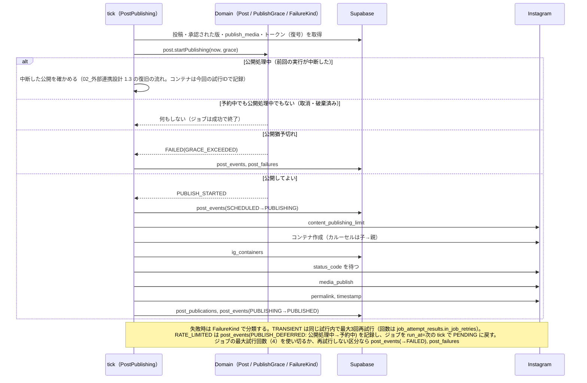

# REQ-001 設計: 予約投稿が確実に動く土台（フェーズ1）

> 「コードを読めば分かること」は書かない。判断・契約・境界だけを書く。
> 共通: `00_基本設計.md`（構成）、`01_DB設計.md`（DDL・RLS）、`02_外部連携設計.md`（Instagram API・API関数）

## 1. ユースケース（アプリケーション層）  P15

| ユースケース | 種別 | 実行場所 | 入口 | 使うドメインオブジェクト |
|---|---|---|---|---|
| 初回ログインでメンバーと結びつける | 更新 | 画面 → RPC | `link_my_member()` | Member |
| メンバーを招待する／ロールを変える／無効化する | 更新 | 画面 → RPC | `MemberAdministration.invite / changeRole / deactivate` | Member, Role |
| Instagram と連携する | 更新 | API関数 | `InstagramConnecting.start / complete` | InstagramConnection, AccessToken, TokenExpiry |
| 投稿を作る（画像をそろえる） | 更新 | 画面 | `PostDrafting.create / revise` | Post, PostMediaList, ImageSpec, Caption, PrCategory |
| 承認を依頼する | 更新 | 画面 | `PostDrafting.requestApproval` | Post, PostStatus |
| 承認して予約する（フェーズ1は簡易） | 更新 | 画面 → RPC | `PostApproval.approve` | Post, ScheduledAt, Role |
| 予約を取り消す | 更新 | 画面 | `PostApproval.cancelSchedule` | Post |
| 失敗した投稿を再実行する | 更新 | 画面 → RPC | `PostApproval.retry` | Post, ScheduledAt |
| 投稿カレンダーを見る | 参照 | 画面 | `PostCalendarQuery.month` | PostStatus（色区分） |
| 警告を見る | 参照 | 画面 | `AlertQuery.current` | Alert, TokenExpiry, BatchHeartbeat |
| 公開用画像を準備する | 更新 | 定期処理 tick | `MediaPreparation.run` | Post, PostMediaList |
| 予定どおり公開する（中断した公開の確認を含む） | 更新 | 定期処理 tick | `PostPublishing.run` | Post, PublishGrace, FailureKind, Job, PublishResult |
| 実行期限切れのジョブを回収する | 更新 | 定期処理 tick | `JobRecovery.run` | Job, Post |
| トークンを更新する | 更新 | 定期処理 daily | `TokenRenewal.run` | InstagramConnection, TokenExpiry |

### シナリオ（P30）

| シナリオ | 手順（使うサービス） | 事前条件 | 結果 |
|---|---|---|---|
| 予約投稿する | 投稿を作る → 承認を依頼する → 承認して予約する → （tick）公開用画像を準備する → 予定どおり公開する | Instagram 連携中 | 公開済み、メディアID・パーマリンク |
| 失敗から立て直す | 警告を見る → 投稿詳細で失敗理由を確認 →（連携切れなら Instagram と連携する）→ 再実行する | 投稿が失敗 | 予約中 → 公開済み |
| tick（15分ごと） | 稼働記録（開始）→ 実行期限切れのジョブを回収する → 公開用画像を準備する → 予定どおり公開する → 稼働記録（終了） | — | — |
| daily | 稼働記録 → トークンを更新する →（REQ-004 の収集）→ 稼働記録 | — | — |

アプリケーション層は「取得 → ドメインに命じる → 保存」だけにする。例えば公開ジョブで「公開猶予を過ぎたか」「リトライしてよいか」の判断は `PublishGrace` と `FailureKind` が持ち、`PostPublishing` には if を書かない。

## 2. ドメインモデル  P05–P14 P29

用語は `docs/model/domain.yaml`。ここでは**どこに業務ロジックを置くか**と、TS／Java の分担を書く。

| オブジェクト | 置く業務ロジック | TS（画面・API関数） | Java（定期処理） |
|---|---|---|---|
| `Post`（集約） | 状態遷移の命令（requestApproval, approve, …）を受け、`PostStatus` に可否を問い、出来事（`PostEvent`）を返す。`publishCaption()` | ○ | ○（公開系の遷移のみ） |
| `PostStatus` | 遷移表、`canEdit()`、`calendarColor()` | ○ | ○ |
| `PostFormat` | 枚数範囲（1 / 2〜10）、公開手順の選択 | ○ | ○ |
| `PostMediaList` | 連番、枚数、カルーセルの比率の一致 | ○ | ○（公開前の再検証） |
| `ImageSpec` | JPEG・8MB・比率・幅の判定と、満たさない項目の列挙 | ○ | ○ |
| `Caption` / `Hashtag` | 2,200字・30個、`prefixed(label)` | ○ | ○ |
| `PrCategory` | `applyLabel(caption, label)`（PRのみ付与） | ○ | ○ |
| `ScheduledAt` | 未来・1年以内（確定時点）、`isDue(now)` | ○ | ○ |
| `PublishGrace` | `allowsAutoPublish(scheduledAt, now)` | — | ○ |
| `FailureKind` | `retryableInSameJob()`、`guidance()`（画面の対処文言） | ○（guidance） | ○ |
| `TokenExpiry` | `remainingDays(now)`、`needsRefresh`、`needsWarning`、`shouldFailWorkflow(refreshFailed)` | ○（警告） | ○ |
| `Alert` | 重要度・文言・リンク | ○ | — |
| `Role` | `canApprove()`、`canAdminister()` | ○ | — |
| `Job` / `JobType` / `JobStatus` | 最大試行回数・実行期限、`retryOrFail()` | — | ○ |

- **二重実装の扱い（ADR-0005）**: 同じルールを TS と Java に持つものは、`docs/model/fixtures/*.json`（実装時に作成）に**共通のテストケース**（入力と期待値）を置き、両方の単体テストが同じファイルを読む。遷移表は DB（`post_status_transitions`）にも置き、最後の砦にする。
- 予約日時の「未来であること」は**確定時点**の不変条件。公開時には過去になっているのが正常なので、`ScheduledAt` の生成（DB から復元）では検査しない。生成方法を3つに分ける: 確定用 `ScheduledAt.decide(value, now)`（未来・1年以内）、再実行の「今すぐ」用 `ScheduledAt.immediate(now)`、復元用 `ScheduledAt.restore(value)`。
- PR入稿由来の投稿のPR区分の固定（BR-003-07）は、ステマ対策の要なので ADR-0005 の二重実装の対象にし、画面（TS）・一括生成（Java）・**公開直前（Java、`post_origins` からネタの出どころを引いて検査）**の3か所で `IdeaSource.prCategoryLocked()` を確かめる。公開直前に違反があれば公開せず、失敗区分 MEDIA_REJECTED（画像・内容の不備）、説明「PR入稿の投稿がPR区分=通常になっています」で失敗にする。

## 3. 画面  P32

| 画面（タスク） | 利用者の関心事 | 表示するドメインオブジェクト | 項目の並び・グルーピング | 状態ごとの見せ方（ドメインが返す） |
|---|---|---|---|---|
| S-01 ログイン | Googleでログインする | — | 「Googleでログイン」ボタンのみ | 許可されていない → 「利用が許可されていません。管理者に連絡してください」（AC-001-01/02） |
| S-02 ホーム | 今後の予定と問題 | Alert 一覧、投稿カレンダー（月） | 上: 警告バナー（重要度順）／中: 承認待ち・失敗の件数カード／下: 月カレンダー（日ごとに投稿のサムネイルと状態色） | 色: 下書き=灰、承認待ち=黄、予約中=青、公開処理中=青点滅、公開済み=緑、失敗=赤（`PostStatus.calendarColor()`）。失敗は理由と「再実行」を表示（AC-001-22） |
| S-03 投稿を作る（スマホからの投稿が主。2026-10-02 梶原の指示で作り込み） | 画像・キャプションをそろえる | Post（最新の版）、PostMediaList、Caption、PrCategory | 上: ナビゲーションバー（キャンセル）／①画像（「写真を撮る」=カメラ・「写真を選ぶ」=ライブラリ、並べ替え・切り取る位置）②キャプション（残り文字数・ハッシュタグ数）③PR区分／画面下に固定: 「下書き保存」「承認を依頼」（作成中はタブバーを隠す） | 投稿種別は選ばせず枚数で決める（`PostMediaList.format()`。1枚=画像、2枚以上=カルーセル）。不備は項目の下に表示。新規の入力は端末（localStorage）に一時保存し、カメラから戻った・再読み込みしたときに復元する。入力欄は16px以上（iPhone の自動拡大を防ぐ） |
| S-04 投稿詳細（`/posts/view?id=…`。静的出力のため動的ルートは使わない。ADR-0002） | 確認して進める | Post、PostEvent 一覧、PublishResult、FailureReason | ①プレビュー（実際の公開キャプション）②状態と予約日時 ③操作ボタン ④履歴 | ボタンは状態×ロールで出し分け（下表）。失敗なら `FailureKind.guidance()` |
| S-11 設定 | 連携とメンバー | InstagramConnection、Member 一覧 | ①Instagram 連携（ユーザー名・有効期限・連携／解除。管理者のみ操作）②メンバー（招待・ロール・無効化。承認者以上） | 期限が近い／更新失敗は赤字。承認者には管理者ロールの選択肢を出さない（`role.assignableRoles()`） |

S-04 の操作ボタン（`Post.canApprove(role)` / `canRetry(role)` などの判断メソッドがドメインで返す。画面は並べるだけ。2026-10-02 実装時に、文字列の操作コード一覧ではなく型で確かめられる判断メソッドに変更）:

| 状態 | 編集者 | 承認者・管理者 |
|---|---|---|
| 下書き | 編集、承認を依頼、破棄 | 同左 |
| 承認待ち | — | 日時を選んで承認、下書きに戻す（フェーズ3で「修正指示」）、破棄 |
| 予約中 | — | 予約を取り消す（下書きに戻る） |
| 公開処理中 | — | — |
| 公開済み | Instagramで見る | 同左 |
| 失敗 | — | 再実行（今すぐ／日時指定）、下書きに戻す、破棄 |

### 3.1 画像のアップロード処理（ブラウザ内）

サーバーの CPU を使わないため、変換はブラウザで行う（AC-001-04〜06）。

1. `<input type="file" accept="image/jpeg,image/png,image/heic" multiple>`（iOS は HEIC を JPEG に変換して渡すことが多い。要確認：変換されない端末では「JPEG で選び直して」と表示）
2. `createImageBitmap` で読み込み（EXIF の向きを反映）
3. 目標比率を決める: 1枚目の比率を `[0.8, 1.91]` に丸めたもの。カルーセルの2枚目以降は1枚目と同じ比率
4. 比率に合うよう中央トリミング（ドラッグで位置調整可）→ 幅 `min(元の幅, 1440)` に縮小（320未満は拒否）
5. `canvas.toBlob('image/jpeg', 0.9)`。8MB を超えたら品質を 0.8 → 0.7 と下げる
6. `ImageSpec` で再検証し、`uploads-private/{tenant_id}/posts/{uuid}.jpg` へアップロード（supabase-js）→ `post_media` を記録

### 3.2 PWA

- `manifest.webmanifest`（名前「新島info 投稿」、standalone、縦向き）。アイコンは `public/icons/`（「新」の文字。他社ロゴに似せない）。iOS は `apple-touch-icon` と `appleWebApp` でホーム画面に追加できる。`viewport-fit=cover` で画面端まで使い、余白は `env(safe-area-inset-*)` で取る
- Service Worker は入れていない（フェーズ1）。入れる場合も静的ファイルのキャッシュのみ（データはキャッシュしない。古い状態で承認する事故を防ぐ）

## 4. 外部との契約  P20 P21 P33

- Instagram（OAuth・公開・更新）: `02_外部連携設計.md` 1章
- API関数: `POST /api/instagram/connect`, `GET /api/instagram/callback`
- 画面 → DB の読み取りは supabase-js（RLS）。**書き込みはすべて RPC**（投稿の状態を変える出来事は直接 INSERT できない）:

| RPC | 利用側の関心事 | 入力 | 書くもの | 権限 |
|---|---|---|---|---|
| `link_my_member()` | 初回ログイン | なし | member_auth_links | 本人 |
| `invite_member(email, display_name, role)` / `change_member_role` / `deactivate_member` | メンバーを増やす・変える・外す | メール・表示名・ロール | members, member_role_changes, member_deactivations | 承認者・管理者（新島info側で運用）。ADMIN の付与・変更・無効化は管理者のみ |
| `save_post_revision(post_id?, revision jsonb)` | 下書きを保存 | 版の内容（画面のドメインで検証済み） | posts・post_events(CREATED)（新規時）, post_revisions, post_media / post_slides | メンバー。版の追加は下書きのときだけ（トリガー） |
| `request_approval(post_id, revision_id)` | 承認を依頼 | 最新の版 | post_events(APPROVAL_REQUESTED) | メンバー |
| `approve_post(post_id, revision_id, scheduled_at)` | 承認して予約 | 承認依頼された版・予約日時 | post_events(APPROVED), post_schedules（ジョブは tick が積む）, generation_feedbacks(APPROVED。フェーズ2) | 承認者・管理者 |
| `cancel_schedule(post_id)` | 予約を取り消す | — | post_events(SCHEDULE_CANCELLED) | 承認者・管理者 |
| `retry_post(post_id, scheduled_at)` | 再実行 | 予約日時（今すぐは `ScheduledAt.immediate`） | post_events(RETRIED), post_schedules（ジョブは tick が積む） | 承認者・管理者 |
| `return_to_draft(post_id)` / `discard_post(post_id)` | 下書きに戻す・破棄 | — | post_events | 承認者・管理者（下書きの破棄は全ロール） |
| `change_member_role` / `deactivate_member`（V7 で置き換え） | 自分自身は変更・無効化できず、最後の有効な管理者は外せない（AC-001-24） | — | member_role_changes, member_deactivations | 承認者・管理者 |
| `send_back_to_draft(post_id)`（V7） | 承認待ちを下書きに戻す（フェーズ3で修正指示に置き換え） | — | post_events(REVISION_REQUESTED) | 承認者・管理者 |
| `disconnect_instagram()`（V7） | Instagram連携を解除 | — | instagram_disconnections | 管理者 |
| `record_instagram_connection(...)`（V7） | OAuth コールバックで連携と最初のトークンを1トランザクションで記録 | 暗号文（base64）・IV・鍵の版・期限 | instagram_connections, instagram_token_grants | service role（API関数）のみ |

- フェーズ1の画面ではジャンルを選ばない（REQ-001 の受入基準に無く、ジャンルの登録画面も無いため）。版の `genre_id` は空で保存する。ジャンルを必須にするのは、ジャンル管理を入れる工程で決める。

- RPC は**記録・権限・版の整合**だけを担い、業務判断は画面のドメインで行ってから呼ぶ（判断を DB に重複させない）。DB は「出来事の種類と遷移の組」の表・版の固定・制約で最後の砦になる（`01_DB設計.md` 3章）。現在状態の不一致（P0409）は「他の人が先に操作しました。画面を更新してください」と表示する。
- ジョブの `dedupe_key`: `PREPARE_MEDIA:{post_id}:{post_schedules.id}`、`PUBLISH_POST:{post_id}:{post_schedules.id}`。予約の確定（承認・再実行）ごとに新しいジョブになり、同じ確定で二重に積まれない。再実行で同じ版の画像が既に準備済みなら、準備ジョブはすぐ成功で終わる（`publish_media` が冪等）。
- ジョブは tick の最初に、予約の確定からまとめて積む（`01_DB設計.md` 3章。2026-10-02 実装時に変更）。公開ジョブの `run_at` は予約日時、公開用画像の準備ジョブの `run_at` は積んだ時刻（すぐ準備する）。

## 5. 永続化  P17 P18 P19 P31

| 保存先 | 記録する事実（コト） | 記録のタイミング | 制約 | 欠損を許す項目と理由 |
|---|---|---|---|---|
| post_revisions / post_media | 内容の版 | 保存のたび（下書きのときだけ） | 版番号の一意、正の数（画像仕様・文字数はドメイン。ADR-0005） | generation_id（手書きの版）、genre_id（承認依頼までは未選択可） |
| post_events | 状態の出来事 | 操作・定期処理 | 遷移表への外部キー、現在状態との一致（トリガー）、追記のみ | revision_id / actor / note（理由は DDL） |
| post_schedules | 予約日時の確定 | 承認・再実行 | event_id 一意 | なし |
| publish_media | 公開用画像 | 準備ジョブ | パス一意、(版, 順番) 一意 | なし |
| ig_containers | コンテナ作成 | 公開ジョブ | container_id 一意 | なし |
| post_publications | 公開 | 公開成功 | post_id 主キー（1回だけ） | なし |
| post_failures | 失敗理由 | 失敗 | event_id 一意 | なし |
| instagram_token_grants | トークンの取得・更新 | OAuth・daily | IV 12バイト | なし |
| jobs / job_attempts / job_attempt_results | 予定表 / 試行 / 結果 | — | 状態とロックの整合 CHECK | post_id（投稿に関係しないジョブ）、locked_until（実行中以外） |
| batch_heartbeats | 稼働 | tick・daily の開始と終了 | (workflow, run_id, phase) 一意 | なし |

- **状態の導出**: 投稿状態は `post_events` の最新、予約日時は `post_schedules` の最新、公開結果は `post_publications`（`post_current` ビュー）。UPDATE しない。
- **マッピング**: Java は `PostRepository`（infrastructure, JDBC/Spring `JdbcClient`）が `post_current` と各テーブルから `Post` を組み立て、`Post` が返した `PostEvent` を INSERT する。TS は `src/lib/api/postRepository.ts` が同じことを supabase-js で行う。ORM の自動マッピングは使わない（オブジェクトとテーブルを一致させないため。P31）。

## 6. 定期処理の詳細

### 6.1 tick の処理順序

```text
main(--job=tick):
  heartbeat(STARTED)
  JobRecovery.run()            # locked_until < now() の RUNNING を Job.recoverExpired() に委ねる:
                               #   attempts < max → PENDING（公開ジョブなら、次の実行で中断した公開を確かめる）
                               #   attempts = max → FAILED。投稿が公開処理中なら Post.fail(UNKNOWN,
                               #   「Instagramで公開済みか確認してください」) も記録
  loop until 残り時間 < 2分 or ジョブなし:
    job = claim_next_job(PREPARE_MEDIA, JobType.PREPARE_MEDIA.lockDuration(), runId) → MediaPreparation
  loop until 残り時間 < 1分 or ジョブなし:
    job = claim_next_job(PUBLISH_POST, JobType.PUBLISH_POST.lockDuration(), runId)   → PostPublishing
  heartbeat(FINISHED)
  exit 0（個別ジョブの失敗ではワークフローを失敗させない）
```

- 1回の tick の持ち時間は **8分**（`timeout-minutes: 10`）。超えそうならジョブを取らずに終わり、次の tick に回す。
- 公開ジョブは「同じ投稿の公開用画像の準備ジョブが成功している」ことを前提にする。未完了なら `run_at = now() + 15分` で PENDING に戻す（試行回数は戻さない。最大試行回数 `PUBLISH_POST = 4`）。

### 6.2 公開用画像の準備（PREPARE_MEDIA）

| 版の画像の出どころ | 処理 |
|---|---|
| UPLOAD | `uploads-private` から `media-public/{tenant_id}/{uuid}.jpg` へ Storage の copy。`ImageSpec` で再検証 |
| TEMPLATE | REQ-002 の画像化（Playwright）。フェーズ1では使わない |

結果を `publish_media` に記録。既に同じ版・同じ順番の記録があれば何もしない（冪等）。

### 6.3 公開（PUBLISH_POST）



- 公開するのは `post_current.approved_revision_id`（承認された版）。最新の版ではない。
- 公開の直前に、承認された版の `PostMediaList` と `publish_media` の枚数・比率を `ImageSpec` で再検証する（DB に不整合があっても Instagram に送らない）。
- 同じく公開の直前に、PR入稿由来の投稿のPR区分が通常になっていないかを確かめる（2章）。
- トークンは公開ジョブの中でだけ復号し、ログに出さない（`AccessToken.toString()` は伏せ字）。

### 6.4 トークン更新（daily）

```text
TokenRenewal.run():
  conn = 現在の連携（なければ終了。警告は画面側で CONNECTION_MISSING）
  expiry = TokenExpiry(conn.expiresAt)
  if !expiry.needsRefresh(now): return OK
  try refresh → instagram_token_grants(REFRESH)
  catch e → instagram_token_refresh_failures
           if expiry.shouldFailWorkflow(refreshFailed=true, now): return FAIL_WORKFLOW
main(--job=daily) は FAIL_WORKFLOW を受けたら、他の処理を終えてから exit 1
```

### 6.5 GitHub Actions ワークフロー（tick.yml の骨子）

```yaml
on:
  schedule: [{ cron: "*/15 * * * *" }]
  workflow_dispatch: {}
concurrency: { group: tick, cancel-in-progress: false }
jobs:
  tick:
    runs-on: ubuntu-latest
    timeout-minutes: 10
    steps:
      - uses: actions/checkout@v4
      - uses: actions/setup-java@v4
        with: { distribution: temurin, java-version: "17", cache: maven }
      - uses: actions/cache@v4            # Playwright のブラウザ（フェーズ2〜）
        with: { path: ~/.cache/ms-playwright, key: pw-${{ hashFiles('backend/pom.xml') }} }
      - run: ./mvnw -B -q -DskipTests package
        working-directory: backend
      - run: java -jar target/batch.jar --job=tick --run-id=${{ github.run_id }}
        working-directory: backend
        env: { SUPABASE_DB_URL: ..., SUPABASE_SERVICE_ROLE_KEY: ..., TOKEN_ENC_KEY_V1: ..., IG_API_VERSION: ... }
```

- 毎回のビルドを避けるため、実装時は `main` への push で jar を作り、Actions のキャッシュ（または GitHub Releases）から取得する形にして1回の実行時間を短くする。

## 7. 警告の導出（S-02 のバナー）

`AlertQuery.current(tenant)` が次の記録から `Alert` の一覧を作る（保存しない）。

| 警告 | 条件（導出元） | 重要度 | リンク |
|---|---|---|---|
| CONNECTION_MISSING | `instagram_connection_current` が無い | エラー | 設定 |
| TOKEN_REFRESH_FAILED | `last_refresh_failed_at` がある | エラー | 設定 |
| TOKEN_EXPIRING | `TokenExpiry.needsWarning(now)`（残り14日以下） | 注意 | 設定 |
| PUBLISH_FAILED | 状態=失敗の投稿が1件以上 | エラー | その投稿 |
| BATCH_STOPPED | `batch_heartbeats` の最新（tick）が60分以上前 | エラー | ランブック |
| LLM_LIMIT_NEAR / REACHED | REQ-002 | 注意 / エラー | — |

## 8. 異常系・外部依存の縮退

| 事象 | 振る舞い | 受入基準 |
|---|---|---|
| 許可リストにない／無効化されたアカウント | RLS で何も読めない。画面は「利用が許可されていません」 | AC-001-01, 02 |
| 画像が仕様外 | ブラウザで変換。変換できない（幅320未満など）は理由を表示 | AC-001-04〜06 |
| 枚数・文字数・PR表記込みの文字数の違反 | 保存・承認依頼を拒否し、違反項目を表示 | AC-001-07〜09 |
| 権限のない操作 | ボタンを出さない。RPC も拒否（42501 → 「権限がありません」） | AC-001-10 |
| 予約日時が過去・1年超 | 承認を拒否 | AC-001-11 |
| 定期処理が遅れて公開猶予切れ | 公開せず失敗（GRACE_EXCEEDED） | AC-001-13 |
| tick の二重起動 | concurrency と claim_next_job で1つだけ実行 | AC-001-14 |
| 公開途中で処理が落ちる | 次の tick で回収された公開ジョブが、中断した公開を確かめる | AC-001-15 |
| Instagram の一時的なエラー | 同じ試行内で最大3回リトライし、回数を記録 | AC-001-16 |
| 24時間の公開数上限 | 公開延期（予約中に戻す）で次の tick へ。最大試行回数を使い切ったら失敗 | BR-001-09 |
| トークン無効 | リトライせず失敗（TOKEN_INVALID）＋連携やり直しの案内 | AC-001-17 |
| 失敗の再実行 | 予約中に戻し、新しい公開ジョブ（dedupe_key が新しい予約で変わる） | AC-001-18 |
| トークン期限 | 30日以下で更新、更新失敗かつ7日以下でワークフロー失敗 | AC-001-19, 20 |
| 定期処理の停止 | BATCH_STOPPED 警告 | AC-001-21 |
| 同時操作（2人が同時に承認） | トリガーで片方だけ成功。もう片方に再読み込みを促す | NFR-001-04 |
| Supabase の障害 | 画面はエラー表示。tick は失敗終了し、次の tick で再開（ジョブは回収される） | — |

## 9. テスト設計（受入基準との対応）

| 層 | 対象 | 受入基準・NFR |
|---|---|---|
| Java ドメイン単体 | PostStatus 遷移、PublishGrace（6:00 ちょうど／6:01）、FailureKind 分類、TokenExpiry（31/30/14/7日）、ImageSpec、Caption（2,200/2,201、ハッシュタグ30/31）、PrCategory | AC-001-07〜09, 11, 13, 17, 19, 20 |
| TS ドメイン単体（Vitest） | 同じ fixtures を読む＋画像変換（比率計算） | AC-001-04〜09, 11 |
| Java 結合（Testcontainers PostgreSQL＋WireMock で Instagram） | claim_next_job の同時取得、公開の成功／リトライ／トークン無効／中断復旧、遷移トリガー | AC-001-12, 14〜18, NFR-001-04 |
| DB（pgTAP または Testcontainers） | RLS（他団体・未登録・無効化・ロール別） | AC-001-01, 02, 10, NFR-001-05 |
| API関数（Vitest＋Miniflare） | OAuth コールバック（state 不一致・期限切れ・account_type）、レスポンスにトークンが無い | AC-001-03, NFR-001-03 |
| E2E（Playwright、モバイル表示） | 承認待ち→承認→予約の3タップ、カレンダーの色、警告 | AC-001-21, 22, NFR-001-02, 06 |

テスト名に `AC-001-xx` / `NFR-001-xx` を含める（ハーネスの紐付け）。

## 10. 決定事項（ADR）

- ADR-0001 定期処理は GitHub Actions、リポジトリは公開
- ADR-0002 管理画面は Next.js 静的出力＋Pages Functions
- ADR-0003 Instagram API はInstagramログイン方式
- ADR-0005 TS と Java の二重実装は共通テストケースと DB の遷移表で揃える
- ADR-0006 予定表・カウンタ・照合値は UPDATE / DELETE を許す
- ADR-0007 アクセストークンはアプリで AES-256-GCM 暗号化
